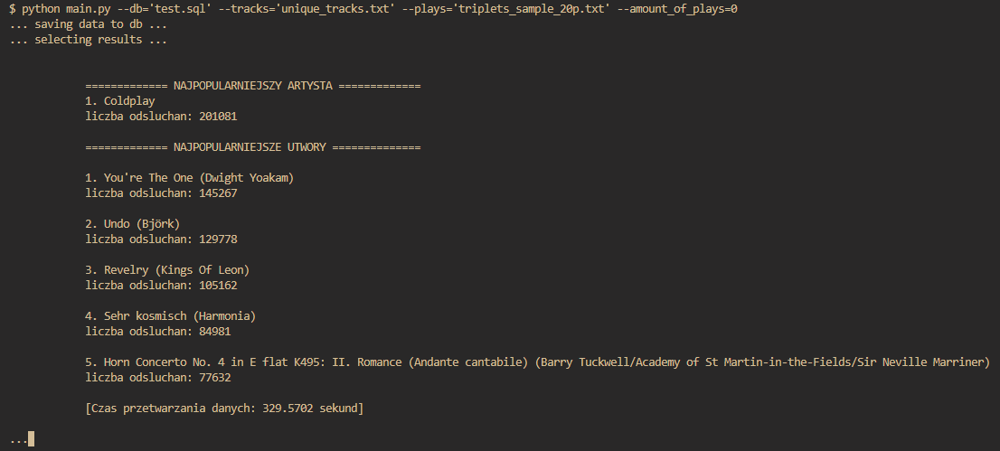
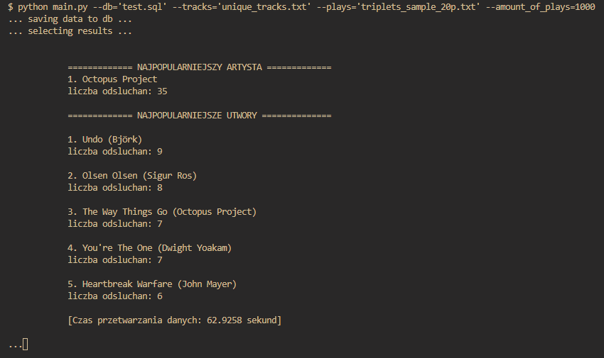

# Ranking najpopularniejszych track'ów (proces ETL)

### Instrukcja uruchomienia
`python main.py --db='test.sql' --tracks='unique_tracks.txt' --plays='triplets_sample_20p.txt' --amount_of_plays=100`

### Wyniki dla pełnych danych

### Wyniki dla pierwszych 1000 odsłuchań
